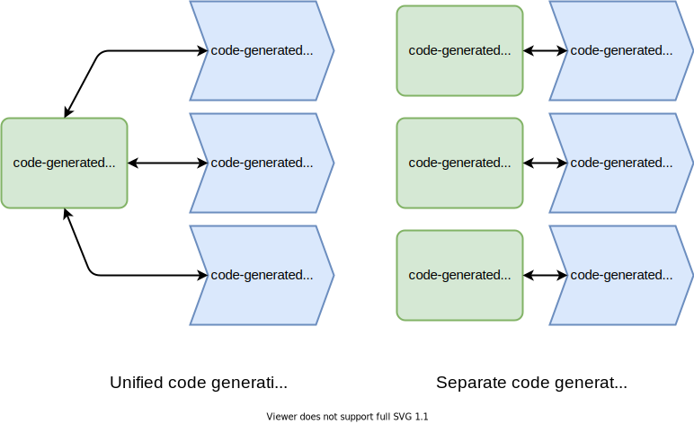

# **Edelweiss**   A decentralized protocol compiler

Petar Maymounkov petar@protocol.ai

---
# Challenges of decentralized development

- **Interaction with multiple protocols, using different data models**
  - _IPLD, Protobuf, FlatBuffers, JSON, Apache Avro, Apache Arrow, etc._
  - _read from Git, write to IPFS/Filecoin_
- **Implementations in different languages**
  - _Go, JavaScript/TypeScript, Rust, Python, etc._
- **Variety of RPC networking stacks**
  - _JSON-over-HTTP, CBOR-over-libp2p, Protobuf, GRPC, etc._
- **New abstractions**
  - _Smart contracts exchange callbacks over network boundaries_

---
# Solution

**An extensible, modular, code-generating compiler with a unified type system:**

- **Unified type system**
     _Any protocol or schema can be described strictly by a common type system_
- **Code-generating**
     _De/serialization and RPC code is generated for multiple target languages_
- **Modular**
     _Custom code-generation backends for different (a) serialization formats, (b) RPC networking stacks and (c) target languages_
- **Extensible**
     _New types can be added, as needed_

---
# **Unified type system**

---
# Types

**Non-parametric**
  - **Builtin:** Bool, Float, Int, Byte, Char, String, Bytes
  - **Special:** Any, Nothing

**Parametric**
  - **Composite:** Link, List, Map, Structure, Tuple, Inductive
  - **Functional:** _Function_, _Service_, _Method_
  - _**Combinatorial:** **Singleton**, **Union**_

**Future candidates**
- Int128, UInt256, Float64, ...

---
# Value of type unification

Generated code can use the same data with multiple serializations/representations without copying it:

---
# Combinatorial types

Conventional schemas (Protobuf, IPLD schema, GraphQL, etc.) cannot express:
- "this value is either of type X or of type Y"
- "this value always equals V"

**Union(X, Y, Z)**: This value is either of type X or type Y or type Z.
**Singleton(V)**: This value always equals V.

Union and singleton give the type system the full power of a _parsing grammar_, when describing recognizable data structures:
- _E.g. **any** set of "recognizable" JSON structures can be described as a type._

---
# **User interface**
